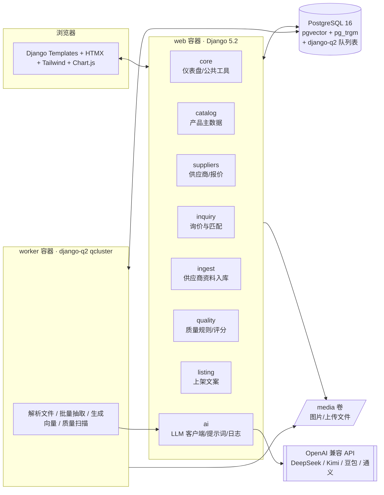
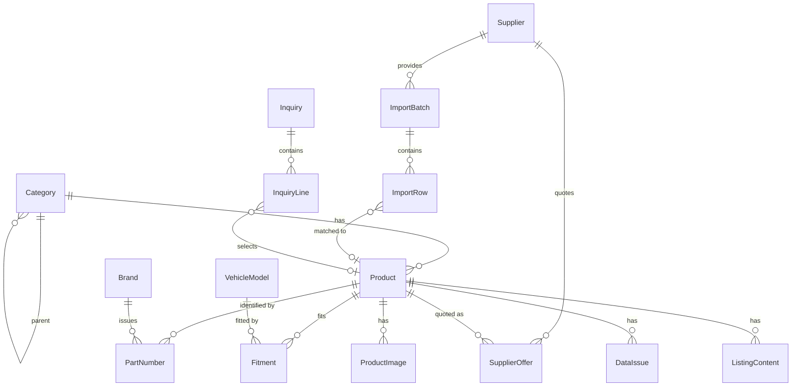
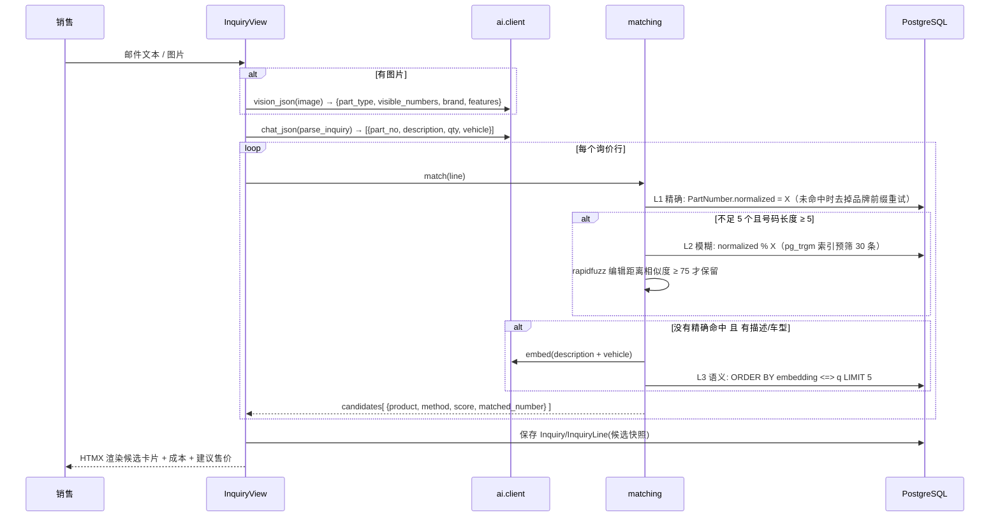
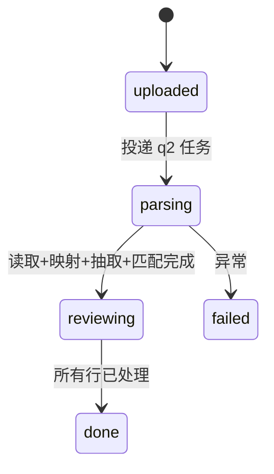

# 系统设计：卡车配件 AI 产品数据中心（MVP）

| 项 | 内容 |
|---|---|
| 文档版本 | v0.1 |
| 更新日期 | 2026-09-17 |
| 关联文档 | [PRD.md](./PRD.md) |

> 迭代约定：改动架构、数据模型、匹配/评分算法时，同步更新本文件对应章节；做出新的技术取舍时，在 §11 追加一条 ADR（不要删除旧 ADR，被替代的标注「已被 ADR-xx 替代」）。

---

## 1. 设计原则

1. **零件号是一等公民**：外贸配件业务里，客户、供应商、平台之间沟通的"通用语言"是 OE 号和 Cross 号，而不是我们内部的 SKU。数据模型和匹配算法都围绕零件号设计。
2. **AI 给建议，人做决定**：所有 AI 产出（抽取、匹配、补全、文案）都带来源与置信度，写入主数据前需人工确认。
3. **确定性优先，AI 兜底**：能用规则解决的（号码归一化、精确匹配、单位标准化、价格计算）不用 AI；AI 用于非结构化理解（邮件、PDF、图片、文案）。
4. **离线可演示**：任何 AI 能力都有 Mock 实现，没有 Key / 没有网络也能完整演示。
5. **简单可交付**：单体 Django + 单个 PostgreSQL，一条 `docker compose up` 启动；复杂度留给后续迭代。

---

## 2. 整体架构



**部署**：`docker-compose.yml` 三个服务：
- `db`：`pgvector/pgvector:pg16`，数据卷持久化
- `web`：`python manage.py runserver 0.0.0.0:8000`（演示用；生产换 gunicorn）
- `worker`：`python manage.py qcluster`，与 web 共用镜像和 media 卷

---

## 3. 模块划分

| App | 职责 | 依赖 |
|---|---|---|
| `core` | 首页仪表盘、`normalize_part_no()` 等公共工具、基础抽象模型（时间戳） | — |
| `catalog` | Category / Brand / VehicleModel / Product / ProductImage / PartNumber / Fitment；产品列表与详情 | core |
| `suppliers` | Supplier / SupplierOffer；报价比价、建议售价计算 `pricing.py` | catalog |
| `ai` | `client.py`（chat_json / vision_json / embed）、`mock.py`、PromptTemplate、AICallLog、`embeddings.py` | core |
| `inquiry` | Inquiry / InquiryLine；`matching.py` 匹配管线；报价邮件与 PDF | catalog, suppliers, ai |
| `ingest` | ImportBatch / ImportRow；`readers.py`（Excel/PDF 读取）、`extract.py`（列映射与抽取）、`tasks.py`、审核页 | catalog, suppliers, ai, inquiry.matching |
| `quality` | DataIssue；`rules.py` 规则注册表、`scoring.py` 完整度评分、`fixes.py` 修复动作、看板 | catalog, suppliers, ai |
| `listing` | ListingContent；文案生成、校验、CSV 导出 | catalog, ai |

依赖方向单向：`core ← catalog ← suppliers ← {inquiry, ingest, quality, listing}`，`ai` 仅依赖 core。**匹配管线只在 `inquiry/matching.py` 实现一次**，入库模块复用它。

---

## 4. 数据模型



### 4.1 关键表说明

**Product**（产品主数据，内部 SKU）

| 字段 | 类型 | 说明 |
|---|---|---|
| sku | Char unique | `FIT-00001` |
| name_en / name_cn | Char | 英文名面向客户，中文名面向内部 |
| category | FK Category | |
| specs | JSON | `{"diameter_mm": 430, "thickness_mm": 45, ...}`，键名统一 snake_case + 单位后缀 |
| weight_kg, package_l_cm, package_w_cm, package_h_cm, qty_per_package | Decimal/Int | 包装物流信息 |
| description_en | Text | |
| status | Char | draft / active / archived（合并后归档） |
| merged_into | FK self null | 被合并时指向保留 SKU |
| completeness_score | SmallInt | 缓存值，质量扫描时更新 |
| embedding | Vector(1024) null | 由「名称+品类+规格+适配车型+号码」文本生成 |

**PartNumber**（核心映射表）

| 字段 | 说明 |
|---|---|
| product | FK Product |
| number | 原始写法，保留用于展示（如 `81.50804-6004`） |
| normalized | 归一化结果（`81508046004`），**B-tree 索引 + GIN trigram 索引** |
| type | OE / CROSS / SUPPLIER |
| brand | FK Brand（号码所属品牌：Volvo、Knorr-Bremse…） |

唯一约束：`(normalized, brand, product)`，防止重复挂号；允许同一号码挂多个 SKU（这本身就是质量问题 DUP_PART_NUMBER，需要被发现而不是被数据库拒绝）。

**SupplierOffer**：保留历史，不覆盖。字段 `cost_price, currency(CNY/USD), moq, lead_time_days, packaging, quoted_at, supplier_part_no, source_import_row(FK null)`。

**Category**：增加 `margin_rate`（默认 0.30），用于建议售价。

**ImportRow**：`raw`（原始行 JSON）、`extracted`（标准字段 JSON）、`matched_product`、`match_method`、`confidence`、`status`（pending / approved / rejected / new_product）、`errors`（校验错误列表）。

**InquiryLine**：`query`（原始文本行）、`parsed`（`{part_no, description, qty, vehicle}`）、`candidates`（匹配结果快照 JSON，记录当时的得分，便于复盘）、`selected_product`、`qty`、`unit_price_usd`、`feedback`（null / correct / wrong）、`feedback_note`。

**AICallLog**：`task, model, prompt_code, prompt_version, request(JSON), response(Text), tokens_in, tokens_out, latency_ms, success, error, is_mock, created_at`。

**PromptTemplate**：`code, version, content, is_active, note`；`(code, version)` 唯一。代码中通过 `get_prompt(code)` 取激活的最高版本；数据库无记录时回退到 `apps/ai/prompts/*.txt` 默认模板（并由 seed 写入数据库）。

---

## 5. 零件号归一化

```python
def normalize_part_no(s: str) -> str:
    # 全角转半角 → 去除空白与 - . / _ → 大写 → 去掉常见前缀噪声(如 "OE:", "NO.")
```

示例：

| 原始 | 归一化 |
|---|---|
| `81.50804-6004`（MAN） | `81508046004` |
| `A 000 420 20 20`（奔驰） | `A0004202020` |
| `20 837 792`（Volvo） | `20837792` |
| `w962`（MANN） | `W962` |

注意：前导字母不能去（奔驰 `A`），前导 0 不能去。

---

## 6. 匹配管线（`apps/inquiry/matching.py`）



**打分**
- L1 精确：100。支持「Knorr K012345」「MANN W 962/19」这类带品牌前缀的写法（首词匹配品牌名时去掉后重试）
- L2 模糊：`80 + (ratio - 75) / 25 * 15`，区间 80–95；`ratio` 为 rapidfuzz 归一化编辑距离相似度（见 ADR-13）
- L3 语义：`60 + (sim - floor) / (1 - floor) * 20`，截断到 60–80；相似度低于 floor 丢弃。floor 真实向量模型取 0.5、Mock 特征哈希取 0.1（真实模型下任意两条配件文本相似度普遍 > 0.5，不设下限分数会挤在一起）
- 同一产品被多层命中时取最高分；图片来源的结果 × 0.9
- 结果去重、降序、取 Top 5
- 询价行自动选中阈值 ≥ 80：精确与模糊命中会自动选中，**语义结果永远只是建议**，需销售点选

**为什么分层**：见 ADR-07。

**报价**：`suppliers/pricing.py`
```
best_offer = 最近 180 天内 cost_price(换算 USD) 最低的报价；无则取全部历史最低并标记"报价过期"
suggested_price_usd = best_offer_usd × (1 + category.margin_rate)
```
汇率配置在 settings：`FX_TO_USD = {"USD": 1, "CNY": 0.14, "EUR": 1.08}`。报价邮件由 LLM 只负责措辞，价格、号码、数量作为已计算好的数据传入，并在生成后校验邮件中出现的价格与传入值一致（不一致则回退到模板邮件）。

---

## 7. 质量规则引擎与评分（`apps/quality`）

### 7.1 规则注册
```python
@rule(code="MISSING_IMAGE", category="missing", severity="high", title="无产品图片")
def missing_image(qs) -> Iterable[Issue]: ...
```
- 规则函数接收产品列表（已 prefetch），批量产出 Issue，避免 N+1。
- DUP_PART_NUMBER：按归一化号码分组（OE/CROSS），同号挂在 ≥2 个未归档 SKU 即报；Issue 带 `related_product` 用于直接跳到合并页。
- DUP_SIMILAR_NAME：同品类 + 同主机厂品牌 + 规格完全相同 + 名称 token_sort_ratio ≥ 90 + 至少一个共同适配车型。条件刻意偏严，宁可漏报也不制造误报。
- 看板排序按严重度 高 → 中 → 低（数据库 Case/When 排序，不依赖字母序）。
- 扫描任务：删除该产品未解决的旧 Issue → 写入新 Issue → 更新 `completeness_score`。
- 新增规则 = 新增一个函数，不改引擎。

### 7.2 完整度评分（0–100）

| 维度 | 权重 | 满分条件 |
|---|---|---|
| 主图 | 20 | ≥1 张图片 |
| OE 号 | 20 | ≥1 个 OE 号 |
| 适配车型 | 15 | ≥1 条 Fitment |
| 规格 | 10 | specs 非空（≥2 个键得满分，1 个得一半） |
| 包装物流 | 10 | 重量、长宽高、每包数量齐全（按比例） |
| 英文描述 | 10 | description_en ≥ 50 字符 |
| Cross 号 | 5 | ≥1 个 CROSS 号 |
| 供应商报价 | 10 | ≥1 条报价 |

格式类、重复类问题不扣完整度分（它们衡量"对不对"而不是"全不全"），在看板上单独统计。

### 7.3 修复动作（`fixes.py`）
- **单位标准化**：规则映射 `{"MM","毫米","mm."} → mm` 并把 specs 键规范为 `xxx_mm`；纯确定性。
- **号码格式修正**：`number` 去除首尾空白与重复空格（normalized 不变）。
- **合并重复 SKU**：事务内把 PartNumber / Fitment / Offer / Image 迁移到保留 SKU。号码按**归一化值**去重（保留方缺品牌时从被合并方补上），被合并方 `status=archived, merged_into=保留方`，不物理删除以便追溯。
- **AI 补全**：将产品已有数据 + 同品类 3 个高完整度产品作为参考发给 LLM，返回 `{field: {value, reason}}`；MVP 只接受 `name_en`、`description_en` 两个文本字段（服务端白名单二次过滤），展示给用户逐项接受。**不允许 AI 补号码、价格、重量、适配车型**（这些必须有来源）。specs 补全留到 P1，需要先有品类属性模板（ADR-09）。

---

## 8. AI 层设计（`apps/ai`）

### 8.1 统一接口
```python
chat_json(task: str, prompt_code: str, variables: dict, schema: type[pydantic.BaseModel]) -> BaseModel
vision_json(task: str, prompt_code: str, image_path: str, schema) -> BaseModel
chat_text(task, prompt_code, variables) -> str
embed(texts: list[str]) -> list[list[float]]
```
- 基于 `openai` SDK，`base_url / api_key / model` 来自 `.env`；vision 与 embedding 可配不同模型。
- JSON 输出：请求 `response_format={"type":"json_object"}`（不支持时靠提示词约束），用 **pydantic** 校验；校验失败自动重试 1 次并附上错误信息。
- 超时 60s，网络错误重试 2 次（指数退避）。
- 每次调用写 `AICallLog`（Mock 调用也写，`is_mock=True`）。

### 8.2 Mock 实现（`AI_MOCK=1` 或未配置 Key 时）
| 能力 | Mock 策略 |
|---|---|
| 询价解析 | 正则抽取号码样式 token + 数量（`x 10` / `10 pcs` / `qty: 10`），其余文本作为描述 |
| Excel 列映射 | 同义词词典（`原厂号/OEM NO./OE NO./参考号 → oe_numbers` 等）+ rapidfuzz |
| PDF 抽取 | pdfplumber 表格 + 同一套列映射 |
| 图片识别 | 演示照片在 PNG 文本块 `demo_label` 中内嵌了"标准答案"，Mock 读出后返回；其他图片返回固定的刹车片示例 |
| Embedding | **特征哈希**：分词（含中英文、号码）→ 哈希到 1024 维 → L2 归一化。无语义理解但对词重叠有效，保证语义检索流程可演示 |
| 文案/邮件/补全 | 基于模板字符串用产品真实字段拼装 |

### 8.3 提示词
默认模板放在 `apps/ai/prompts/{code}.txt`：`parse_inquiry`、`image_identify`、`map_columns`、`extract_pdf_rows`、`quote_email`、`listing_alibaba`、`listing_shopify`、`fill_missing`。seed 时写入 `PromptTemplate` v1，后台可新建版本。每个模板都包含：角色、领域知识（OE/Cross 概念）、输出 JSON 结构、禁止编造号码/价格的约束。

### 8.4 数据安全
发送给模型的上下文**不包含成本价和供应商名称**（报价邮件只传售价）。

---

## 9. 供应商资料入库流程（`apps/ingest`）



1. **读取**（`readers.py`）：Excel 用 pandas 读取，自动找表头行（前 10 行中非空单元格最多的一行）；PDF 用 pdfplumber 逐页取表格，无表格页取文本。
2. **列映射**（`extract.py`）：把表头 + 前 5 行样例发给 LLM，返回 `{原列名: 标准字段}`；**一个文件只调用一次 LLM**，然后确定性地逐行转换（ADR-10 的思路同样适用：AI 做理解，规则做批量）。PDF 无表格时按 20 行一块调用抽取。
3. **校验与归一化**：价格转 Decimal、MOQ/交期转 int、号码字段按 `, ; / 换行` 拆分并归一化；错误写入 `errors`。
4. **匹配**：对每行依次用 supplier_part_no → oe_numbers → cross_numbers 调用 `matching.match_numbers()`，再用名称做语义兜底。置信度 ≥ 95 预选"通过"，其余 pending。
5. **审核写入**（事务）：通过 → 新增缺失的 PartNumber(CROSS/SUPPLIER)、新增 SupplierOffer；新建 SKU → 创建 draft Product 并挂号码与报价；写入后对受影响产品触发质量重算与 embedding 重建。
6. 进度：`ImportBatch.stats` 实时更新，页面 HTMX 每 2s 轮询。
7. Cross 号的品牌：供应商常写成「KNORR K833444」，写入时用品牌表识别前缀（全名、`-` 前半段或前缀匹配），拆成 `brand=Knorr-Bremse, number=K833444`。OE 号品牌从行内品牌/车型/名称文本推断，推断不出时沿用匹配产品唯一的 OE 品牌。
8. 本地开发可设 `Q_SYNC=True` 同步处理；Docker 中 web/worker 强制 `Q_SYNC=False` 走队列。

---

## 10. 前端设计
- 服务端渲染 + HTMX 局部更新（询价结果、审核行操作、进度轮询、文案生成）。
- Tailwind（Play CDN 运行时）、HTMX、Chart.js 的 JS 文件已下载到 `static/vendor/`，无 Node 构建步骤、无外网依赖（ADR-14）。
- 页面：首页仪表盘 / 产品库 / 产品详情 / 询价工作台 / 询价历史 / 供应商 / 入库批次 / 审核页 / 质量看板 / 提示词与 AI 日志（复用 Django Admin）。
- 顶栏常驻「Demo Data」「AI: Mock / 模型名」标识。

---

## 11. 设计决策与取舍（ADR）

格式：**背景 / 决策 / 备选方案 / 取舍理由 / 何时重新评估**

### ADR-01 以零件号映射表为核心，而非 SKU 表上的号码字段
- **背景**：一个配件对应多个主机厂 OE 号和多个副厂 Cross 号，还有各供应商自己的料号；客户用任意一个来询价。
- **决策**：独立 `PartNumber` 表（一对多），存原始写法 + 归一化值 + 类型 + 品牌。
- **备选**：在 Product 上放 `oe_numbers` 文本/数组字段。
- **取舍**：映射表查询与索引（精确、trigram）都简单高效，能表达号码所属品牌，能发现"同号多 SKU"的重复问题，入库时可逐条增加 Cross；代价是多一次 join 与更多行数，但在百万级号码内 PostgreSQL 足以应对。
- **重新评估**：需要表达"号码之间的替代关系有方向性/有条件"（如仅某年份后替代）时，引入号码关系表。

### ADR-02 Django 模板 + HTMX，而非前后端分离（React/Vue）
- **背景**：MVP 需在短时间内完成且由一人开发；用户是内部员工，交互以表单、表格、列表为主。
- **决策**：服务端渲染 + HTMX 局部刷新，Tailwind/Chart.js 走 CDN。
- **备选**：DRF + React/Vue SPA。
- **取舍**：省掉 API 层、前端构建、状态管理，开发量减半；体验足够流畅。代价是复杂交互（如大表格内联编辑、拖拽）实现受限，以及将来开放 API 需要补 DRF。
- **重新评估**：需要移动端 App、对外开放 API、或出现大量复杂前端交互时，增加 DRF 并逐页迁移。

### ADR-03 PostgreSQL + pgvector，而非独立向量库或 SQLite
- **背景**：需要精确查询、模糊匹配（trigram）、语义检索三种能力，并与业务数据强关联过滤（品类、状态）。
- **决策**：PostgreSQL 16 + `pgvector` + `pg_trgm`，Docker 部署。
- **备选**：SQLite（+ sqlite-vec）；PostgreSQL + Milvus/Qdrant。
- **取舍**：一个数据库同时承载业务数据、向量、模糊索引和任务队列，事务一致、运维简单；SKU 规模（万～十万级）下 pgvector 性能充足。相比 SQLite 需要 Docker，但更接近生产，也支持 trigram 与并发 worker。独立向量库在此规模是过度设计，还带来双写一致性问题。
- **重新评估**：向量规模超过千万级、或需要以图搜图的大规模图像向量时，评估专用向量库。

### ADR-04 django-q2（ORM broker），而非 Celery + Redis
- **背景**：文件解析、批量 AI 调用、全量质量扫描、向量生成需要后台执行；任务量小。
- **决策**：django-q2，使用 Django ORM（PostgreSQL）作为 broker。
- **备选**：Celery + Redis；Django 6.0 内置 Tasks（本项目用 5.2 LTS，不可用）；同步执行。
- **取舍**：少一个 Redis 服务，配置简单，Admin 里可直接看任务结果；吞吐量低于 Redis broker，但 MVP 任务是分钟级少量任务，完全够用。同步执行会导致上传大文件时页面超时。
- **重新评估**：出现高频任务（如每分钟抓取邮箱询盘）或需要复杂编排时迁移到 Celery；升级 Django 6.x 后评估内置 Tasks 框架。

### ADR-05 OpenAI 兼容接口 + Mock，而非绑定单一厂商
- **背景**：公司员工日常使用 ChatGPT/Claude/豆包/Kimi；国内网络环境下演示稳定性重要；模型价格与能力变化快。
- **决策**：统一使用 `openai` SDK 调 OpenAI 兼容接口，`base_url/model` 可配置；vision、embedding 可分别配置模型；提供完整 Mock。
- **备选**：直接使用某一厂商原生 SDK；使用 LangChain 等框架。
- **取舍**：主流国内外模型大多提供兼容接口，切换零代码；不引入 LangChain，调用链路短、易调试。代价是用不到部分厂商特有能力（如原生结构化输出、特殊工具调用），JSON 结果靠 pydantic 校验+重试保证。
- **重新评估**：需要复杂多步 Agent、工具调用编排、或某厂商独有能力显著提升效果时。

### ADR-06 图片询价走「视觉模型 → 结构化文本 → 检索」，而非图像向量检索
- **背景**：客户照片通常是实物件、铭牌或包装标签，关键信息是**可见号码**和配件类型；公司暂无大规模标准产品图库。
- **决策**：视觉大模型输出 `{part_type, visible_numbers, brand, features}`，再进入号码/语义匹配。
- **备选**：CLIP 等图像 embedding 以图搜图。
- **取舍**：视觉模型能读出号码（最有价值的线索），且结果可解释、可人工校对；无需图库和额外模型部署。代价是外观高度相似、无号码的件区分能力弱（如不同尺寸的刹车片）。
- **重新评估**：当产品图库完整（每 SKU 多角度实拍）且询价中无号码照片占比高时，增加图像向量检索作为 L4。

### ADR-07 分层匹配（精确 → 模糊 → 语义），而非全部交给 LLM
- **背景**：号码匹配要求高准确率、低延迟、低成本，且结果必须可解释。
- **决策**：确定性的精确与 trigram 模糊匹配优先，语义向量检索兜底；LLM 只负责把非结构化询价解析为结构化行。每个候选带命中方式和分数。
- **备选**：把产品库作为上下文让 LLM 直接判断；纯向量检索。
- **取舍**：精确匹配毫秒级、零成本、零幻觉，覆盖大多数带号码的询价；LLM 直接判断成本高、不可复现、会编造号码；纯向量检索对号码这类"字符串"效果差。代价是需要维护阈值和打分公式。
- **重新评估**：积累足够反馈数据后，可加入 LLM 重排序（rerank）或学习排序模型，阈值用反馈数据校准。

### ADR-08 AI 只建议、人工审核；价格只来自数据库
- **背景**：错误报价或错误号码会造成直接经济损失和客户信任问题。
- **决策**：入库、补全、合并都经人工确认；售价由规则计算；AI 生成的邮件/文案中的价格与号码做回检；不允许 AI 补全 OE 号。
- **备选**：高置信度自动入库；让 AI 根据市场信息建议价格。
- **取舍**：牺牲部分自动化程度换取可控性，这正是"数据运营"岗位的价值所在。MVP 中置信度 ≥95 只做"预选"不自动写入。
- **重新评估**：反馈数据证明某类场景（如精确号码匹配入库）准确率长期 >99.5% 时，对该类开放自动写入并保留审计日志。

### ADR-09 规格使用 JSONField，而非 EAV 属性表
- **背景**：不同品类规格差异大（刹车盘：直径/厚度/孔数；滤清器：高度/外径/螺纹）。
- **决策**：`Product.specs` 为 JSON，键名规范 `snake_case_单位`，由质量规则约束格式。
- **备选**：EAV（Attribute / ProductAttributeValue）表；每品类一张扩展表。
- **取舍**：JSON 灵活、开发快、PostgreSQL 支持 GIN 索引和键查询，便于 AI 抽取直接写入；代价是缺少数据库层面的类型与必填约束、属性定义不集中。
- **重新评估**：需要按属性做平台级筛选（如 Shopify 过滤器）、或需要品类级必填属性模板时，引入 `CategoryAttribute` 定义表（仍保留 JSON 存值）。

### ADR-10 批量抽取：一个文件一次列映射，而非逐行调用 LLM
- **背景**：供应商 Excel 常有数百到数千行。
- **决策**：LLM 只看表头+样例做列映射，行转换由代码完成；仅 PDF 非表格文本按块调用 LLM。
- **备选**：每行交给 LLM 抽取。
- **取舍**：成本和耗时降低两个数量级，结果一致；代价是单元格内复杂混合内容（如"OE: xxx / Cross: yyy"写在一列）需要规则拆分，拆不了的标记 errors 由人工处理。
- **重新评估**：遇到大量非结构化单元格时，对"映射失败的行"单独调用 LLM。

### ADR-11 平台上架导出 CSV，而非直接对接 Alibaba/Shopify API
- **背景**：平台 API 需要店铺授权与审核，MVP 阶段不具备条件；上架内容需要人工把关。
- **决策**：生成、编辑、确认后导出 Shopify 导入格式 CSV；Alibaba 文案页面复制。
- **备选**：直接调用 Shopify Admin API / Alibaba 开放平台。
- **取舍**：零授权依赖、演示稳定；代价是多一步人工导入，无法回收平台数据。
- **重新评估**：v0.4 平台打通阶段。

### ADR-12 Django 5.2 LTS 单体 + uv + Docker Compose
- **背景**：演示与后续试点都需要稳定、易部署。
- **决策**：Django 5.2 LTS（支持至 2028-04）；uv 管理依赖；Compose 编排 web/worker/db。
- **备选**：FastAPI；Django 6.x。
- **取舍**：Django Admin 直接提供数据维护后台（产品经理/数据运营可立即使用），ORM 与迁移成熟；LTS 适合长期迭代。FastAPI 需要自建后台。
- **重新评估**：LTS 到期前升级。

### ADR-13 模糊号码匹配：pg_trgm 预筛 + 编辑距离打分，而非只用三元组相似度
- **背景**：客户最常见的错误是写错/多写/少写一位。实测一个 8 位 Volvo 号码错 1 位，三元组相似度只有约 0.5，用 0.6 的阈值会漏掉；而降低阈值又会让短号码误匹配大量无关号码。
- **决策**：用 `normalized % query`（pg_trgm，走 GIN 索引，默认阈值 0.3）从全库预筛 30 个候选，再用 rapidfuzz 的归一化编辑距离相似度（≥75）决定是否保留并打分；查询号码归一化后少于 5 位不做模糊匹配。
- **备选**：只用 `TrigramSimilarity` 排序；在 Python 内存里对全部号码做编辑距离；PostgreSQL `fuzzystrmatch` 的 `levenshtein()`。
- **取舍**：预筛保证性能随号码规模增长仍可用索引；编辑距离更贴合"错几位"的业务直觉，分数可解释。代价是两段式逻辑与两个阈值需要维护；极短号码（如 Textar 5 位号）容易误配，因此不做模糊。
- **重新评估**：积累询价反馈后，用"正确/错误"数据校准 75 这个阈值；若出现大量字母/数字易混（O/0、I/1）错误，增加字符混淆归一化。

### ADR-14 前端依赖本地化（static/vendor），而非运行时走公共 CDN
- **背景**：演示环境可能在国内网络或客户现场，公共 CDN（尤其 Tailwind Play CDN、unpkg）访问不稳定，一旦加载失败页面完全没有样式。
- **决策**：把 tailwindcss.js、htmx.min.js、chart.umd.min.js 固定版本下载到 `static/vendor/` 随代码提交。
- **备选**：CDN 引入；引入 Node + Tailwind CLI 构建精简 CSS。
- **取舍**：零构建、离线可用、版本锁定；代价是 Tailwind Play 运行时约 450KB 且在浏览器端生成样式，首屏略慢，不适合生产。
- **重新评估**：进入正式试点（v0.2）时改用 Tailwind CLI 构建静态 CSS。

---

## 12. 目录结构

```
truck-parts-data-center/
├── docker-compose.yml  Dockerfile  pyproject.toml  uv.lock  .env.example
├── manage.py  README.md  CLAUDE.md
├── config/            settings.py  urls.py  wsgi.py
├── apps/
│   ├── core/          utils.py(normalize_part_no)  views.py(dashboard)
│   ├── catalog/       models.py  admin.py  views.py  management/commands/seed_demo.py
│   ├── suppliers/     models.py  pricing.py
│   ├── ai/            client.py  mock.py  schemas.py  prompts/*.txt  embeddings.py
│   ├── inquiry/       models.py  matching.py  quoting.py  views.py
│   ├── ingest/        models.py  readers.py  extract.py  tasks.py  views.py
│   ├── quality/       models.py  rules.py  scoring.py  fixes.py  views.py
│   └── listing/       models.py  generate.py  views.py
├── templates/         base.html  <app>/*.html  partials
├── demo_data/         生成的供应商文件/示例图片
├── docs/              PRD.md  DESIGN.md
└── tests/
```

---

## 13. 测试策略
- **单元测试（pytest + pytest-django，AI_MOCK=1）**：号码归一化、精确/模糊/语义匹配打分、定价计算、每条质量规则、完整度评分、Excel 表头识别与列映射、合并 SKU 事务。
- **集成测试**：seed 少量数据 → 询价端到端；上传示例 Excel → 审核 → 断言新增 Offer 与 PartNumber。
- **测试数据库**：使用 Compose 中的 PostgreSQL（pgvector/trgm 无法在 SQLite 上测试）。
- **人工验收**：按 PRD §8 演示脚本走通；真实模型 Key 再走一遍，检查 AICallLog。

---

## 14. 变更记录

| 日期 | 版本 | 变更 |
|---|---|---|
| 2026-09-17 | v0.1 | 初稿：架构、数据模型、匹配/评分算法、AI 层、ADR-01～12 |
| 2026-09-17 | v0.1.1 | 按实现同步：模糊匹配改为 trigram 预筛 + 编辑距离（ADR-13）、品牌前缀识别、语义结果不自动选中、AI 补全字段收窄、合并按归一化号码去重、前端依赖本地化（ADR-14） |
